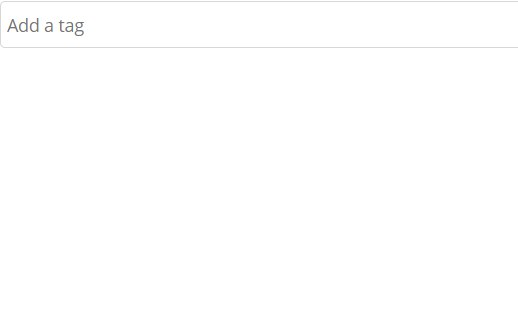

# Tag
Display and manipulate tag labels.

## Features
* Add and remove tags
* Auto suggest

## Dependencies
Mendix 7.6

## Demo project
https://tag100.mxapps.io

## Usage
Place the widget in a data view, with a data source that has attributes for the tag

Enable creation, lazyloading, suggestions and set taglimit

Add limit message, placeholder and tag style.

Add tag entity and tag attribute.

## Issues, suggestions and feature requests
We are actively maintaining this widget, please report any issues or suggestion for improvement at https://github.com/mendixlabs/tag/issues

## Development
Prerequisite: Install git, node package manager, webpack CLI, grunt CLI, Karma CLI

To contribute, fork and clone.

    > git clone https://github.com/mendixlabs/tag.git

The code is in typescript. Use a typescript IDE of your choice, like Visual Studio Code or WebStorm.

To set up the development environment, run:

    > npm install

Create a folder named `dist` in the project root.

Create a Mendix test project in the dist folder and rename its root folder to `dist/MxTestProject`. Changes to the widget code shall be automatically pushed to this test project.
Or get the test project from [https://github.com/mendixlabs/tag/releases/latest](https://github.com/mendixlabs/tag/releases/latest)

To automatically compile, bundle and push code changes to the running test project, run:

    > grunt

To run the project unit tests with code coverage, results can be found at `dist/testresults/coverage/index.html`, run:

    > npm test

or run the test continuously during development:

    > karma start

